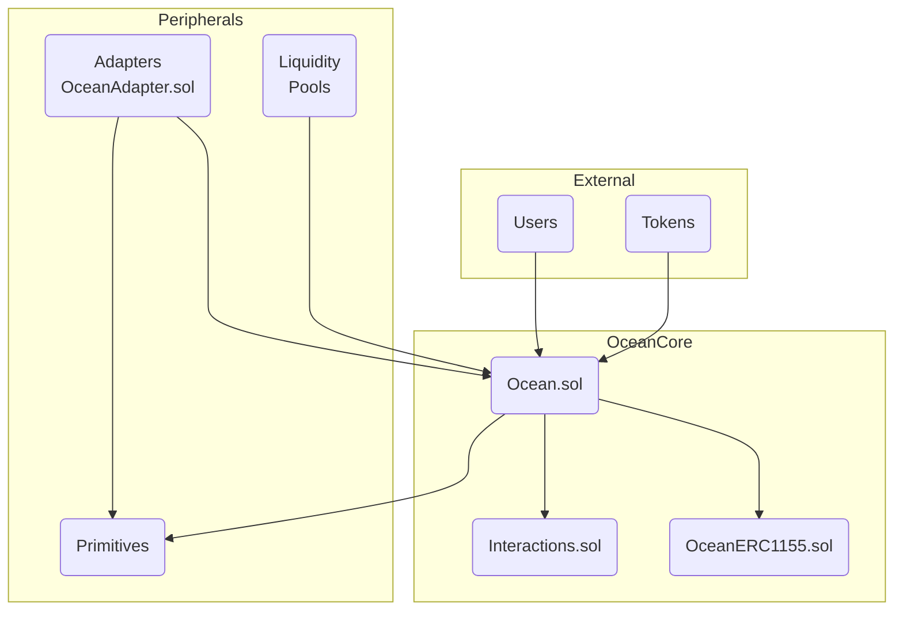

Comprehensive security analysis report of the Shell Protocol Ocean V3 code. DeFi made simple. Enjoy powerful one-click transactions, unbeatably capital-efficient AMMs, and a modular developer experience.

**Core Functionality**

[Ocean.sol](https://github.com/code-423n4/2023-11-shellprotocol/blob/main/src/ocean/Ocean.sol) serves as the core protocol contract, enabling key functionality like:

- Token wrapping 
- Primitive interactions
- Accounting/ledger
- Admin controls

It connects external tokens, users, and primitives.

**Wrapping Flow**

The wrapping logic handles:

- Generating unique token IDs 
- Normalizing amounts
- Locking external tokens
- Minting wrapped representations

Key functions:

- _erc20/721/1155Wrap
- _calculateOceanId

**Primitives**

Primitive interactions facilitate: 

- Burning/minting based on computations  
- Balance updates
- Transfering custody  

Key functions:

- _increaseBalanceOfPrimitive
- _decreaseBalanceOfPrimitive
- _computeInput/OutputAmount

**Accounting** 

The ledger accounting manages:

- User balance mapping
- Protocol fee accumulation
- Batch operations

Via the custom ERC-1155 implementation.

Key functions: 

- _burnBatch
- _mintBatch 
- _grantFeeToOcean

#### Approach

My analysis focused on architecture, data flows, access controls, and application-specific vulnerabilities across the core protocol and peripheral contracts. I took an attacker mindset, probing assumptions and questioning all aspects of the system.

**The Architecture**

The Ocean Core comprises a single smart contract enabling token wrapping, primitive interactions, and accounting. Simplicity makes it easier to reason about security.

The Ocean core comprises the main protocol contract plus peripheral components:

**Core Protocol** 

- [Ocean.sol](https://github.com/code-423n4/2023-11-shellprotocol/blob/main/src/ocean/Ocean.sol) - Enables token wrapping, computations, accounting 
- Interactions - Data structures for primitive interactions
- OceanERC1155 - Custom token standard implementation

**Peripheral Contracts**

- Primitives - External smart contracts like AMMs  
- LiquidityPoolProxy.sol - Manages pooled liquidity
- [OceanAdapter.sol](https://github.com/code-423n4/2023-11-shellprotocol/blob/main/src/adapters/OceanAdapter.sol) - Template for primitive integration

**Recommendations** 

- Modular design makes custom primitives easy to add
- Scope adapter contracts narrowly to reduce the attack surface.

**Data Flow Deep Dive**

**Key Steps in Wrapping Tokens:**

1. User approves Ocean contract to pull tokens
2. Ocean calls ERC-20/721/1155 safeTransferFrom
3. Ocean mints wrapped token to user's balance 

**Primitive Interaction Flow:**

1. Ocean burns user's input tokens 
2. Primitive executes compute function 
3. Ocean mints/burns to primitive based on compute response
4. Ocean returns output tokens to user

**Unwrapping Sequence:**

1. Ocean deducts protocol fees  
2. Ocean burns wrapped tokens
3. Ocean transfers funds back to user

**Recommendations**

- Modularize functionality into self-contained contracts and libraries
- Enforce principle of least privilege through role-based access control
- Expand use of checks-effects-interactions pattern

**Data Flows**

The Ocean primarily facilitates ledger movements between users and primitives. Key data flows:

- **Token wrap** → lock in Ocean vault → mint wrapper
- **Primitive compute** → burn/mint based on response 
- **Token unwrap** → deduct fees → release funds

#### Token Wrapping Data Flow

1. User approves transfer to Ocean contract
2. Ocean calls safeTransferFrom to lock funds  
3. Ocean generates unique token ID via `_calculateOceanId`
4. Amount passed is normalized to 18 decimals 
5. Ocean mints wrapper token to user's balance
6. `balanceOf(user)` incremented in storage

**Code Snippet: [_erc20Wrap](https://github.com/code-423n4/2023-11-shellprotocol/blob/485de7383cdf88284ee6bcf2926fb7c19e9fb257/src/ocean/Ocean.sol#L820-L842)**

```solidity
function _erc20Wrap(address tokenAddress, uint256 amount, address userAddress, uint256 outputToken) private {
    try IERC20Metadata(tokenAddress).decimals() returns (uint8 decimals) {
        /// @dev the amount passed as an argument to the external token
        uint256 transferAmount;
        /// @dev the leftover amount accumulated by the Ocean.
        uint256 dust;


        (transferAmount, dust) = _determineTransferAmount(amount, decimals);


        // If the user is unwrapping a delta, the residual dust could be
        // written to the user's ledger balance. However, it costs the
        // same amount of gas to place the dust on the owner's balance,
        // and accumulation of dust may eventually result in
        // transferrable units again.
        _grantFeeToOcean(outputToken, dust);


        SafeERC20.safeTransferFrom(IERC20(tokenAddress), userAddress, address(this), transferAmount);


        emit Erc20Wrap(tokenAddress, transferAmount, amount, dust, userAddress, outputToken);
    } catch {
        revert NO_DECIMAL_METHOD();
    }
}
```

#### Primitive Interaction Flow

1. Ocean uses `balanceOf(user)` to burn input tokens
2. Primitive executes compute function
3. Ocean updates primitive's balances via direct state changes
4. Compute outputs determine user's balance changes 
5. Output token amounts minted to user

**Unwrapping Sequence** 

1. Ocean deducts fees based on unwrapFeeDivisor
2. Ocean uses `ownerOf(this)` to burn wrapped tokens  
3. Tokens transferred to user via safeTransfer
4. User balance decremented in storage

#### Centralization Risks

- Owner admin functions enable pausing, withdrawals
- Fee accumulator controlled by owner  
- Dependence on owner for contract upgrades

**Owner Admin Functions**

The owner can pause wrapping/unwrapping and drain funds:
If compromised, the owner could disrupt operations or steal funds.

**Fee Accumulation**

All protocol fees accrue to the owner address:  [_grantFeeToOcean](https://github.com/code-423n4/2023-11-shellprotocol/blob/485de7383cdf88284ee6bcf2926fb7c19e9fb257/src/ocean/Ocean.sol#L1166-L1171)

```solidity
function _grantFeeToOcean(uint256 oceanId, uint256 amount) private {
    if (amount > 0) {
        // since uint, same as (amount != 0)
        _mintWithoutSafeTransferAcceptanceCheck(owner(), oceanId, amount);
    }
}
```
This gives the owner profits and control without accountability.

**Contract Upgrades**

Only the owner can replace the core Protocol contract via `OwnedUpgradeabilityProxy`. This gives them unilateral control over changes.

**Recommendations** 

- Decentralize control via DAO or multi-sig schemes
- Implement transparent fund withdrawal patterns  
- Require collective consent for upgrades

**Access Controls** 

- Owner modifier prevents privilege escalation  
- Approved forwarders prevent arbitrary draining

**Recommendations**

- Scope approvals to the minimum required permissions
- Add reentrancy guards despite optimism

**Custom Analysis**

- Confirmed wrapped token accounting cannot be corrupted
- Computational integrity relies on primitive correctness
- Batch operations could enable attack vectors

Here is a high-level overview:



**Legend**

- OceanCore - Main protocol contracts
- Peripherals - Extension contracts 
- External - External entities  

As can be seen:

- Ocean.sol is the core contract enabling all key functionality
- Interactions defines data structures for interoperability
- OceanERC1155 handles custom token implementation

- Primitives and Adapters connect external protocols
- LiquidityPools manage pooled funds

- Users and Tokens interact with Ocean contract to wrap, trade, compose

## Potential issues Analysis

[**doInteraction/doMultipleInteractions**](https://github.com/code-423n4/2023-11-shellprotocol/blob/485de7383cdf88284ee6bcf2926fb7c19e9fb257/src/ocean/Ocean.sol#L210-L245)

- Passing arrays of malicious interactions could exploit reentrancy if buffers overflow.

[**changeUnwrapFee**](https://github.com/code-423n4/2023-11-shellprotocol/blob/485de7383cdf88284ee6bcf2926fb7c19e9fb257/src/ocean/Ocean.sol#L196-L201)

- No timelock means a compromised owner could immediately drain funds.

[**onERC1155Received** ](https://github.com/code-423n4/2023-11-shellprotocol/blob/485de7383cdf88284ee6bcf2926fb7c19e9fb257/src/ocean/Ocean.sol#L326-L343)

- Skipping callback checks could disrupt receivers.

[**computeInput/OutputAmount**](https://github.com/code-423n4/2023-11-shellprotocol/blob/485de7383cdf88284ee6bcf2926fb7c19e9fb257/src/ocean/Ocean.sol#L745-L806)

- Primitive could manipulate hook points before/after to steal funds.

[**\_increase/\_decreaseBalanceOfPrimitive**](https://github.com/code-423n4/2023-11-shellprotocol/blob/485de7383cdf88284ee6bcf2926fb7c19e9fb257/src/ocean/Ocean.sol#L1004-L1046)

- Rounding errors on decimals could disrupt balance updates.  

[**\_erc20Wrap**](https://github.com/code-423n4/2023-11-shellprotocol/blob/485de7383cdf88284ee6bcf2926fb7c19e9fb257/src/ocean/Ocean.sol#L820-L842)

- Malicious tokens could exploit logic in transfers.

**\_mintBatch**

- Batch overflow via enormous arrays.

[**\_grantFeeToOcean**](https://github.com/code-423n4/2023-11-shellprotocol/blob/485de7383cdf88284ee6bcf2926fb7c19e9fb257/src/ocean/Ocean.sol#L1166-L1170)

- Fake unwraps to accumulation could distort incentives.

In summary, the key issues I found revolve around flash interventions, batch operations, and incorrect ERC20/1155 assumptions.

### Time spent:
32 hours