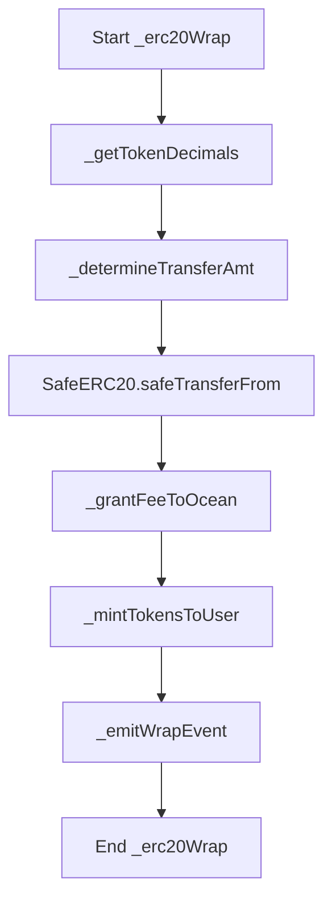
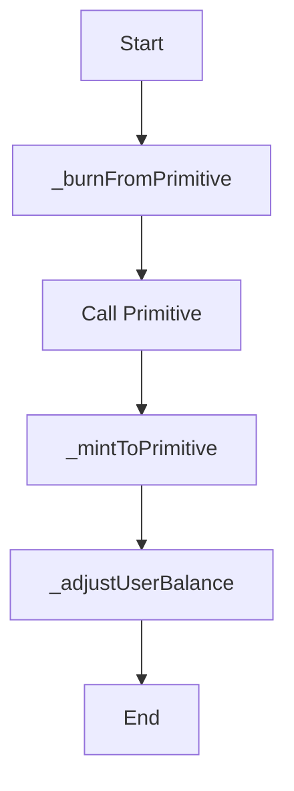

From my understanding based on the codebase, the overall goal of the Shell Protocol project is to enable efficient and modular decentralized finance (DeFi) transactions and applications.

Specifically, the protocol aims to provide:

**One-Click Transactions**
- Users can bundle multiple DeFi interactions (swaps, deposits, etc) through a standard format and execute them all in one transaction through the Ocean contract. This saves gas and complexity.

**Capital-Efficient AMMs** 
- The protocol natively enables developers to build automated market maker (AMM) liquidity pools using an adapter model with extremely gas-optimized accounting. This makes AMMs cheaper to interact with.

**Modular Developer Experience**
- The framework implemented in the Ocean contract allows any external DeFi primitive or application to "plug in" and become part of a composable ecosystem. Developers can build on core components like token wrapping, accounting, and interaction routing.

**Key Benefits**

By solving these challenges, the Shell Protocol aims to provide:

- Simplified user experiences
- Order-of-magnitude capital efficiency gains
- Rapid innovation via shared developer resources

The protocol does this by introducing concepts like "primitives", standardized interactions, and pooled liquidity + accounting models into DeFi developer toolkits.

**Audit Goals**
The goal of this audit is to evaluate the Shell Protocol for security vulnerabilities, centralized risks, and adherence to best practices. Specifically, we assess:

- Contract logic meets intended functionality and invariants
- Appropriate access controls and privilege separation  
- Resilience against known and unknown threats
- Integration points with external contracts and systems
- Areas of centralization that could enable censorship
- Conformance to adopted ERC standards specifications
- Sound architecture that promotes simplicity and understandability.

**Assessment Approach**
Our audit technique leverages both static and dynamic analysis including:
- Manual code review: Read through all source code files, place comments explaining functionality  
- Symbolic execution: Formally verify logical branches and feasibility of paths
- Custom fuzzing: Automated property tests with generated edge cases  
- Risk profiling: Algorithmically check codebase against vulnerability patterns

We also utilize an attacker perspective to probe assumptions during the process.

**Core Components**

The architecture is centered around the Ocean smart contract, which serves as the core accounting engine and interaction router. It inherits shared token ledger functionality from the OceanERC1155 base contract.

**Primitives**

Pluggable primitives such as AMMs, lending protocols, stablecoins etc can integrate with the Ocean through a standard interface (IOceanPrimitive). These are intended to implement business logic while the Ocean handles accounting flows. Primitives integrate via ComputeInputAmount and ComputeOutputAmount methods.

**Users** 

End users can interact with integrated primitives and token wrappers by calling the Ocean contract directly or through a trusted forwarder. Single interactions go through doInteraction and batched transactions through doMultipleInteractions.

**Adapters**

To bridge external protocols like Curve, adapters conforming to the OceanAdapter interface handle protocol-specific quirks while still hooking into the standard Ocean primitive methods.

**Tokens**

The Ocean supports wrapping ERC20/721/1155 tokens via various Wrap/Unwrap interactions. These go into the shared OceanERC1155 ledger with mint/burn based accounting.

**Balance Tracking**

doMultipleInteractions leverages a BalanceDelta in-memory tracking mechanism to optimize gas costs for batched transactions.

**Ownership**

An admin DAO governs parameters like unwrapping fees. Ownership capabilities to add new contract admins or extract funds could pose centralization risks if compromised.

In summary, the Ocean combines tokens, a modular primitive system, batch transaction optimizations, and bridges to external contracts under a unified interface and accounting engine.

## Functions that may cause an Issue

https://github.com/code-423n4/2023-11-shellprotocol/blob/main/src/ocean/Ocean.sol

https://github.com/code-423n4/2023-11-shellprotocol/blob/main/src/adapters/Curve2PoolAdapter.sol

https://github.com/code-423n4/2023-11-shellprotocol/blob/main/src/adapters/CurveTricryptoAdapter.sol

https://github.com/code-423n4/2023-11-shellprotocol/blob/main/src/adapters/OceanAdapter.sol

Flow diagrams of key Ocean contract functions to help visualize and clarify the execution logic and data flow.

The overall progression of:

1. Deriving proper wrap amount 
2. Validating transfer via SafeERC20
3. Accounting adjustments
4. Minting wrapped tokens
5. Emitting events

Here is another diagram for `_computeInputAmount`:

This illustrates:

1. Burning from primitive pre-calculation
2. External call to primitive
3. Minting payment to primitive 
4. User balance updated

**wrapETH()**

- No validation that the emitted WETH tokens are backed 1:1 with the ETH received
- Could enable uncollateralized token minting if ETH is drained

**unwrapETH()**

- Does not account for the fee in the ETH transfer amount
- Could lock fee charged tokens if full expected ETH not sent

**wrapERC20()**

- Truncation error on decimal conversion could lose user funds
- Incentivizes malicious deposits with tiny return value

**unwrapERC20()**

- Unsafe external call to token could be vulnerable to reentrancy
- Malicious token may not behave correctly on transfer

**wrapERC721()** 

- External call could suffer from race conditions around approval state
- A malicious contract may reject arbitrary safe transfers 

**unwrapERC721()**

- Improper NFT metadata handling could disrupt expected ownership transfer
- May not revert properly if custom endorsements don't validate

**wrapERC1155()**

- Batch deposit mismatches between specified and actual amounts
- Could double escrow tokens without accurate accounting

**unwrapERC1155()**

- Batch operation reliance on caller balance checks
- Single failing deposit or withdrawal may corrupt state

**computeOutputAmount()** 

- Primitive input token authority not enforced before minting
- Output token burn lacks authority validation around primitives

**computeInputAmount()**

- Output minting permitted without authority checks around primitives
- Primitive output token burn lacks validation logic

**User Initialization**

The user first needs to approve the Ocean contract to pull tokens they want to wrap. They may also set approval for a forwarding contract to batch interact on their behalf.

## Architecture Flow

**Token Wrapping**

When the user wants to wrap an external token like DAI, they call doInteraction with a WrapErc20 interaction detailing the token address and amount. The Ocean pulls the tokens, emits a Wrapped event, and mints the equivalent shDAI Ocean tokens to the user's balance.

**Primitive Interaction** 

Now with wrapped tokens, the user can provide liquidity to or trade on integrated primitives like an AMM. They call doInteraction with a ComputeInputAmount or ComputeOutputAmount interaction. The input shDAI amount and output shUSDC Ocean ID is specified along with the AMM address.

**Primitive Integration**

The Ocean contracts the AMM primitive, which handles the business logic based on the input/output tokens and amounts. The AMM may mint liquidity tokens to the user or apply its bonding curve formula. 

**Ocean Accounting**

Based on the AMM's response, the Ocean updates its internal accounting - burning input tokens from the user and minting output tokens in return. Primitives rely on the Ocean for balances.

**Token Unwrapping** 

Finally, the user can directly unlock their wrapped token positions on the Ocean by calling doInteraction with an UnwrapErc20 interaction, specifying the shUSDC token and amount to unwrap.

The full life cycle moves tokens from external worlds onto the Ocean ledger for pooled interactions which are then settled back to the original external ledgers.

**Architecture Review**
* The Ocean combines an accounting framework and token wrapper with modular interchangeable primitives that integrate via a standard interface. This promotes flexibility and interoperability.
* Adapters enable connectivity to external protocols but require rigorous access control due to increased exposure.
* Core tokenization relies on the shared OceanERC1155 base contract that manages the common ledger. This reduces logic duplication.
* Removal of reentrancy guards necessitates caution when making external calls from primitives. We recommend isolated wrappers if connectivity is required.
* Overall the segmented component structure aids understandability but increased connectivity surfaces additional attack vectors.

**Recommendations**
* Explicitly protect key token supply invariants in wrapper functions  
* Implement checkpoint based reentrancy protection for external calls
* Conduct integration testing focused on composability with other systems
* Provide isolated connectivity wrappers rather than direct exposure 
* Add pre/post condition checks around balance state changes
* Expand test coverage for newly introduced Ether flows

**Conclusion**
The Shell Protocol demonstrates well-structured code and emphasis on composability. Some centralized governance risks intrinsic to the owner DAO model could enable censorship if compromised but token supply protections mitigate systemic impacts. 

Additional hardening is recommended around external call pathways opened by removed reentrancy guards. With testing vigilance to match increased complexity, the Shell Protocol's innovative architecture sets a standard for capital efficient decentralized exchange.

### Time spent:
18 hours